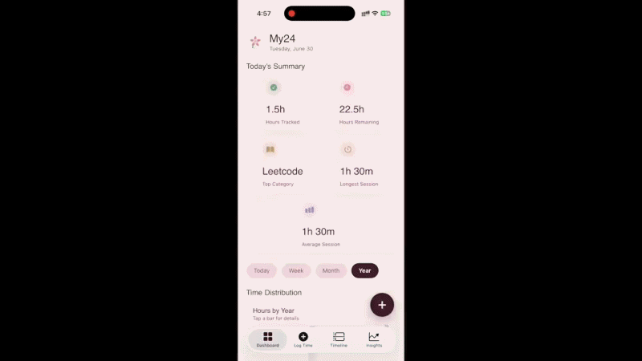
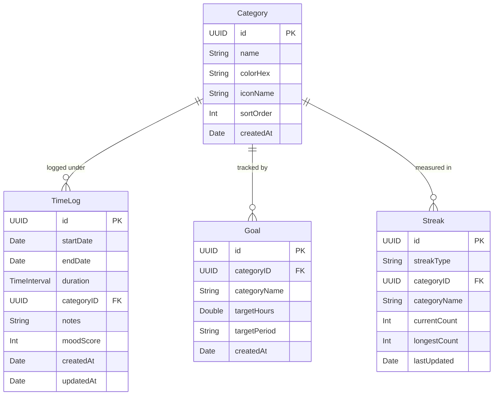
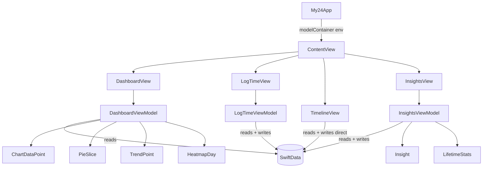
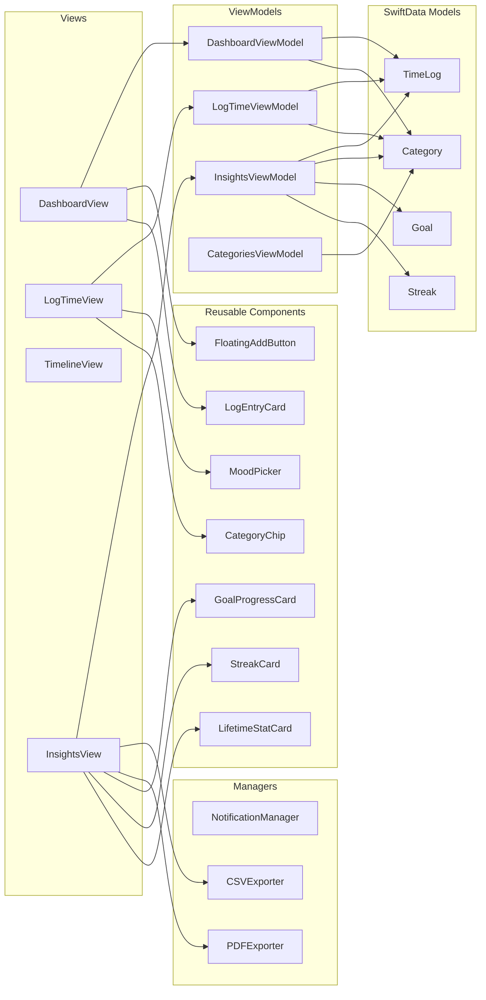

# My24

> *Track your day. Understand your life.*

My24 is a minimalist iOS time-tracking app built around a simple question: **where did your 24 hours actually go?**

Most productivity apps tell you what to do with your time. My24 helps you understand how you're already spending it — by making logging effortless and turning your data into beautiful, honest insights over days, weeks, months, and years.

The design is intentionally calm and botanical — soft pinks, sage greens, warm creams — because time is personal, and the app you open every day should feel like a place you actually want to be.



<br>

## What it does

- **Log time** via a live timer or manual entry, with categories, notes, and a mood score
- **Visualize your day** on an Apple Calendar–style timeline with color-coded activity blocks
- **Understand patterns** through bar charts, pie charts, a calendar heatmap, and a weekly trend line — all interactive
- **Set goals** (e.g. 5h/week of exercise) and track progress with live completion bars
- **Build streaks** — daily logging, category-specific — with current and personal-best counts
- **See the full picture** with lifetime statistics: total hours, most productive day, longest session, category breakdowns, and more
- **Export** your data as CSV or a formatted PDF report

<br>

## Installation

### Requirements

- A Mac running macOS 14 or later
- Xcode 16 or later (free from the Mac App Store)
- An iPhone or iPad running iOS 18+, **or** an iOS 18+ simulator

### Steps

**1. Clone the repository**
```bash
git clone https://github.com/yourusername/My24.git
cd My24
```

**2. Open in Xcode**

Open `My24.xcodeproj` in Xcode. If you don't have the `.xcodeproj` yet, create a new SwiftUI + SwiftData project in Xcode and copy the source files in — see the folder structure section below.

**3. Add the Playfair Display font**

Download [Playfair Display](https://fonts.google.com/specimen/Playfair+Display) from Google Fonts. Drag these three files into Xcode's project navigator:
- `PlayfairDisplay-Regular.ttf`
- `PlayfairDisplay-SemiBold.ttf`
- `PlayfairDisplay-Italic.ttf`

Then in your target's **Info** tab, add `Fonts provided by application` as an array with those three filenames.

**4. Add your app logo**

In `Assets.xcassets`, create a new Image Set named `AppLogo` and drag your PNG in. The header component already references this name.

**5. Run on simulator**

Select any iPhone 18+ simulator from the device dropdown and press `⌘R`. The app seeds default categories on first launch automatically.

**6. Run on a real device**

- Connect your iPhone via USB
- In **Signing & Capabilities**, set your Team to your Apple ID (a free account works for personal device testing)
- Select your device and press `⌘R`
- On your iPhone, go to Settings → General → VPN & Device Management → trust your developer certificate

<br>

---

<br>

## Developer Notes

### Philosophy

My24 follows strict **MVVM** (Model–View–ViewModel) and leans on **SwiftData** for persistence rather than Core Data, keeping the model layer declarative and concise. Every screen has its own ViewModel; views are kept as dumb as possible — they bind to published state, they don't compute it.

The UI is intentionally component-driven. Every card, chip, chart wrapper, and stat display is a reusable struct that can be dropped anywhere. This makes adding new tabs or rearranging the information hierarchy cheap.

<br>

### Folder Structure

```
My24/
├── App/                        # Entry point, tab container
├── Theme/                      # Colors, fonts, button styles, modifiers
├── Models/                     # SwiftData @Model classes
├── ViewModels/                 # ObservableObject VMs, one per tab
├── Views/
│   ├── Dashboard/              # Summary cards, charts, log list
│   ├── LogTime/                # Timer, manual entry, save modal
│   ├── Timeline/               # Calendar-style day planner
│   ├── Insights/               # Goals, streaks, lifetime stats, export
│   └── Components/             # All reusable UI components
├── Managers/                   # Notifications, CSV/PDF export
├── Charts/                     # Heatmap and trend line components
├── Extensions/                 # Color(hex:), Date, TimeInterval helpers
└── Resources/                  # PreviewData, Info.plist reference
```

<br>

### Data Models



> Note: SwiftData doesn't use traditional foreign keys — relationships are stored via `UUID` references and resolved in code by the ViewModels. This keeps models portable and avoids SwiftData relationship cascade complexity.

<br>

### ViewModel Responsibilities



<br>

### Architecture: How the pieces connect



<br>

### Key Design Patterns

**SwiftData over Core Data**
All four models are `@Model` classes. The container is created once in `My24App` and injected via `.modelContainer()`, making it available to every view via `@Environment(\.modelContext)`. ViewModels receive the context via a `load(context:)` call from `onAppear`.

**Chart data is computed, not stored**
`DashboardViewModel` fetches raw `TimeLog` records and computes all chart structures (`ChartDataPoint`, `PieSlice`, `TrendPoint`, `HeatmapDay`) in memory on demand. Nothing chart-related touches the database. This keeps the models lean and charts always in sync.

**Streaks are recalculated on every refresh**
`InsightsViewModel.updateStreaks()` derives streak counts from `TimeLog` dates rather than trusting stored counts blindly. The `Streak` model acts as a cache that gets overwritten — this prevents drift if a user deletes a log entry.

**Single shared component for all headers**
`DashboardHeader` is used identically across all four tabs. Changing the logo or subtitle format in one place propagates everywhere.

**MoodScore is stored as `Int` 1–5**
The `Mood` enum provides the display layer (emoji, label, color) but nothing mood-related is stored as a string. This keeps the data portable for future export formats or charting.

**Timer uses `Timer.scheduledTimer`, not `async/await`**
The live timer in `LogTimeViewModel` uses a classic `Timer` rather than Swift concurrency. This is intentional — `@MainActor` isolation means timer tick updates are already guaranteed on the main thread, and a 1-second `Timer` has negligible overhead for this use case.

<br>

### Theme System

All colors, fonts, shadows, and button styles live in `AppTheme.swift` and `Extensions.swift`. Nothing in the Views layer uses hardcoded hex values or raw `UIColor`.

```swift
// Colors
AppTheme.cream          // #FDF6F0 — main background
AppTheme.blushLight     // #FEF0F3 — card backgrounds
AppTheme.blushMid       // #F5DDE4 — selected states, sliders
AppTheme.deepRose       // #4A2030 — primary text, buttons
AppTheme.mutedRose      // #8A5060 — secondary text
AppTheme.softRose       // #B87A90 — tertiary / decorative

// Semantic category colors
AppTheme.sage           // #7DAF8C
AppTheme.lavender       // #B8A0C8
AppTheme.goldCat        // #C8A878

// Typography
Font.playfair(size)         // PlayfairDisplay-Regular
Font.playfairBold(size)     // PlayfairDisplay-SemiBold
Font.playfairItalic(size)   // PlayfairDisplay-Italic
```

The `.themedCard()` view modifier applies the standard card treatment (background, corner radius, shadow) to any view in one line:

```swift
MyView()
    .themedCard()                          // default
    .themedCard(padding: 12, cornerRadius: 20)  // customized
```

<br>

### Notification Strategy

`NotificationManager` schedules a single repeating `UNCalendarNotificationTrigger` at 11:00 PM every day. It's registered once at app launch in `My24App.onAppear` and uses a stable identifier (`my24.daily.reminder`) so re-registering on subsequent launches replaces rather than duplicates the request.

<br>

### Export

| Format | Class | Output |
|--------|-------|--------|
| CSV | `CSVExporter` | Flat file: Date, Start, End, Duration, Category, Notes, Mood |
| PDF | `PDFExporter` | 2-page report: cover page + stats, rendered via `UIGraphics` |

Both write to `FileManager.default.temporaryDirectory` and return a `URL` passed to `UIActivityViewController` for sharing.

<br>

### Dependencies

None. My24 uses only Apple-native frameworks:

| Framework | Used for |
|-----------|----------|
| `SwiftUI` | All UI |
| `SwiftData` | Persistence |
| `Charts` | Bar, pie, sector charts (iOS 16+) |
| `UserNotifications` | Daily reminders |
| `PDFKit` / `UIGraphics` | PDF export |
| `Combine` | `ObservableObject` / `@Published` |

<br>

### Known Limitations & Future Work

- **iCloud sync** — SwiftData supports CloudKit sync, not yet enabled
- **Widgets** — WidgetKit extension for today's tracked hours on the home screen
- **Apple Watch** — companion app for quick timer start/stop from the wrist
- **Drag-to-resize** on Timeline blocks — the UI renders them correctly but drag gesture for resizing is not yet implemented
- **Siri Shortcuts** — `AppIntents` integration for "Start Work timer" from Shortcuts or Siri
- **Dark mode** — theme is currently light-only; named colors in Assets.xcassets would unlock automatic dark variants

<br>

---

Built with SwiftUI · SwiftData · iOS 18 · Xcode 26
